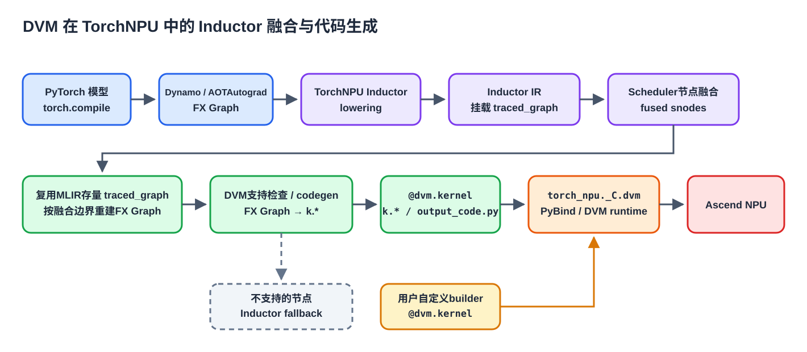
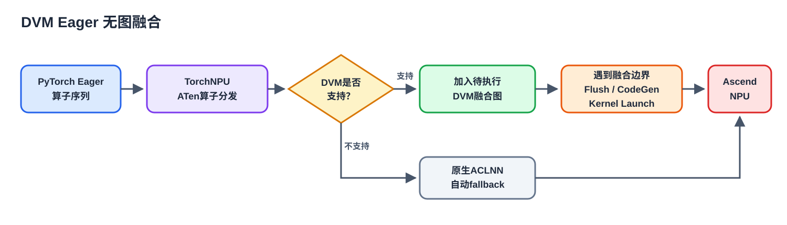

# 如何在TorchNPU中使用DVM

本文面向希望在TorchNPU中使用DVM的开发者，介绍Inductor图融合、DVM自定义算子和Eager无图融合三种路径，再说明TorchNPU内部的对接设计与实现。

推荐使用TorchNPU 26.1.0及以上版本，并选择与PyTorch版本匹配的发行包。DVM当前支持的TorchNPU版本和开发分支如下：

| PyTorch版本或开发分支 | TorchNPU发行标签或分支 |
| --- | --- |
| 2.7.1 | `v26.1.0-pytorch2.7.1` |
| 2.9.0 | `v26.1.0-pytorch2.9.0` |
| 2.10.0 | `v26.1.0-pytorch2.10.0` |
| 2.11.0 | `v26.1.0-pytorch2.11.0` |
| 2.12.0 | `v26.1.0-pytorch2.12.0` |
| master | `master` |

具体的CANN、PyTorch和TorchNPU配套关系以对应TorchNPU版本的发行说明为准。

## 1. 使用场景与配置

| DVM特性 | 覆盖场景 | 使用方法 |
| --- | --- | --- |
| 图融合 | Inductor图模式 | 设置`TORCHINDUCTOR_NPU_BACKEND=dvm`，并调用`torch.compile(..., backend="inductor")` |
| Eager无图融合 | Eager模式 | 设置`TORCH_NPU_LAZY_FUSION=True`，直接运行Eager代码 |
| 自定义融合 | 自定义算子 | 使用`torch_npu._inductor.dvm.kernel`编写`k.*`计算 |

### 1.1 配置汇总

| 类型 | 配置项 | 推荐值或示例 | 说明 |
| --- | --- | --- | --- |
| 环境变量 | `TORCHINDUCTOR_NPU_BACKEND` | `dvm` | 使用Inductor图融合时必需，需在导入PyTorch前设置 |
| 环境变量 | `TORCH_COMPILE_DEBUG` | `1` | 生成`torch_compile_debug`目录和`output_code.py` |
| 环境变量 | `TORCHINDUCTOR_CACHE_DIR` | `/tmp/torchinductor_dvm` | 可选，指定独立的Inductor缓存目录 |
| 环境变量 | `INDUCTOR_DVM_DEBUG_MODE` | `1` | 可选，DVM异常时同步设备并输出`dump`、`das`信息 |
| 环境变量 | `INDUCTOR_DVM_ENABLE_MATMUL_FUSION` | `1` | 可选，仅用于支持DVM MatMul template融合的较新分支 |
| 环境变量 | `TORCH_NPU_LAZY_FUSION` | `True` | 开启Eager无图融合，需在导入`torch`或`torch_npu`前设置 |
| `dvm.config` | `debug_mode` | `False` | 是否在DVM Kernel执行后进行同步和异常调试检查 |
| `dvm.config` | `dump_fx_test` | `False` | 是否导出DVM融合子图的独立FX回归用例 |
| `dvm.config` | `view_fusion_level` | `1` | View融合级别：`0`关闭，`1`要求末维步长为1，`2`始终开启 |
| `dvm.config` | `disable_post_reduce_fusion` | `False` | 是否禁止Reduce节点与后续节点继续融合 |
| `dvm.config` | `enable_matmul_fusion` | `False` | 是否开启MatMul template融合，由`INDUCTOR_DVM_ENABLE_MATMUL_FUSION`在导入时初始化 |
| `dvm.config` | `bf16_vector_keep_promoted` | `False` | 是否将发生类型提升的BF16 Vector计算结果转换回BF16 |

Python侧可以通过`from torch_npu._inductor import dvm`访问表中的`dvm.config`项。这些配置用于Inductor路径，会在相关后端模块加载时读取，应在首次调用`torch.compile`前设置；MatMul融合建议直接使用对应环境变量，并在导入PyTorch前设置。Eager无图融合不读取`dvm.config`，而是使用`TORCH_NPU_LAZY_FUSION`中的独立C++配置。

## 2. Inductor图融合

### 2.1 开启DVM后端

环境变量需要在`import torch`或`import torch_npu`之前设置：

```bash
export TORCHINDUCTOR_NPU_BACKEND=dvm
export TORCH_COMPILE_DEBUG=1

# 可选：使用新目录避免复用其它后端生成的缓存
export TORCHINDUCTOR_CACHE_DIR=/tmp/torchinductor_dvm
```

其中，`TORCHINDUCTOR_NPU_BACKEND=dvm`将NPU Inductor后端切换为DVM；`TORCH_COMPILE_DEBUG=1`生成`torch_compile_debug`目录，便于检查`output_code.py`。环境变量只在Python进程初始化时读取，修改后需要重新启动Python进程。

### 2.2 静态Shape最小示例

```python
import torch
import torch_npu


class DvmDemo(torch.nn.Module):
    def forward(self, x, y):
        value = x * y
        value = value + x
        return torch.relu(value)


x = torch.randn((128, 128), device="npu", dtype=torch.float32)
y = torch.randn((128, 128), device="npu", dtype=torch.float32)

compiled_model = torch.compile(DvmDemo(), backend="inductor", dynamic=False)
out = compiled_model(x, y)
torch.npu.synchronize()
print(out.shape, out.device, out.dtype)
```

`backend="inductor"`进入PyTorch Inductor；是否选择DVM由`TORCHINDUCTOR_NPU_BACKEND`决定。

### 2.3 动态Shape与SymInt示例

下面的模型把输入第0维显式标记为动态维度。`rows = x.shape[0]`在Dynamo/Inductor链路中以`torch.SymInt`表示，并且参与除法计算，因此生成的DVM Kernel既包含动态Tensor Shape，也包含独立的`SymInt`标量输入。

```python
import torch
import torch_npu


class DynamicDvmDemo(torch.nn.Module):
    def forward(self, x, y):
        rows = x.shape[0]  # 动态Shape下为torch.SymInt
        return torch.relu(x + y) / rows


def make_inputs(rows):
    x = torch.randn((rows, 128), device="npu", dtype=torch.float32)
    y = torch.randn((rows, 128), device="npu", dtype=torch.float32)
    torch._dynamo.mark_dynamic(x, 0)
    torch._dynamo.mark_dynamic(y, 0)
    return x, y


model = DynamicDvmDemo().npu()
compiled_model = torch.compile(model, backend="inductor", dynamic=True)

for rows in (32, 48):
    x, y = make_inputs(rows)
    out = compiled_model(x, y)
    expected = model(x, y)
    torch.npu.synchronize()
    torch.testing.assert_close(out, expected, atol=1e-4, rtol=1e-4)
    print(rows, out.shape)
```

同一个`compiled_model`连续执行`32×128`和`48×128`输入，可以验证动态维度变化时无需为固定Shape重写模型。不同版本生成的变量名可能不同，但`output_code.py`中的DVM主体应呈现如下结构：

```python
@dvm.kernel(ktype='vector', dyn_shape=True)
def dvm_fused_add_div_relu_0_build(k):
    arg0_1 = k.load([-1, -1], dvm.float32)
    arg1_1 = k.load([-1, -1], dvm.float32)
    arg2_1 = k.scalar(dvm.int64)
    add = k.add(arg0_1, arg1_1)
    relu = k.maximum(add, 0)
    div = k.div(relu, arg2_1)
    k.store(div, dvm.float32)
```

这里的`dyn_shape=True`表示该Kernel按动态Shape构建，`k.load`中的`-1`表示运行时维度，`k.scalar(dvm.int64)`对应参与计算的`rows: SymInt`。Wrapper调用`.run(...)`时也会把实际动态维度传给DVM Kernel。

### 2.4 确认DVM代码生成

开启`TORCH_COMPILE_DEBUG=1`后，可以查找生成文件：

```bash
find torch_compile_debug -name output_code.py -print
```

静态Shape示例融合成功时，`output_code.py`会导入DVM并生成`@dvm.kernel`。以下为典型结构，具体函数名会随计算图变化：

```python
from torch_npu._inductor import dvm


@dvm.kernel(ktype='vector', dyn_shape=False)
def dvm_fused_add_mul_relu_0_build(k):
    arg0_1 = k.load([128, 128], dvm.float32)
    arg1_1 = k.load([128, 128], dvm.float32)
    mul = k.mul(arg0_1, arg1_1)
    add = k.add(mul, arg0_1)
    relu = k.maximum(add, 0)
    k.store(relu, dvm.float32)


dvm_fused_add_mul_relu_0 = dvm_fused_add_mul_relu_0_build
```

判断是否进入DVM路径时，重点检查：

- 是否存在`from torch_npu._inductor import dvm`；
- 是否存在`@dvm.kernel(...)`；
- Kernel构建函数中是否出现`k.load`、`k.scalar`、`k.add`、`k.mul`、`k.sum`、`k.matmul`、`k.store`等DVM接口；
- Wrapper调用处是否出现对应DVM Kernel的`.run(...)`。

不满足DVM算子、数据类型、Shape或融合规则的节点会保留在Inductor fallback路径中，因此一个模型中可以同时存在DVM Kernel和fallback Kernel。

### 2.5 较新分支的MatMul融合

部分较新开发分支支持将`mm`、`bmm`、`addmm`或`baddbmm`与后续Pointwise计算生成为DVM Mix Kernel。使用前应先确认当前TorchNPU源码中的`torch_npu/_inductor/dvm/config.py`包含`enable_matmul_fusion`配置，然后设置：

```bash
export TORCHINDUCTOR_NPU_BACKEND=dvm
export INDUCTOR_DVM_ENABLE_MATMUL_FUSION=1
export TORCH_COMPILE_DEBUG=1
```

示例计算：

```python
class MatmulEpilogue(torch.nn.Module):
    def forward(self, a, b, residual):
        return (torch.mm(a, b) + residual) * 0.5
```

融合成功时，`output_code.py`通常会出现`ktype='mix'`和`k.matmul`：

```python
@dvm.kernel(ktype='mix', dyn_shape=False)
def dvm_fused_add_mm_mul_0_build(k):
    a = k.load([128, 256], dvm.float16)
    b = k.load([256, 128], dvm.float16)
    residual = k.load([128, 128], dvm.float16)
    mm = k.matmul(a, b, False, False)
    add = k.add(mm, residual)
    out = k.mul(add, 0.5)
    k.store(out, dvm.float16)
```

该开关不是所有26.1.0发行分支的固定配置。若当前分支没有`config.py`或`enable_matmul_fusion`，则不要设置或依赖该开关，具体支持范围以当前分支源码和测试用例为准。

## 3. DVM自定义算子

`dvm.kernel`允许用户直接使用DVM Python接口表达一个Kernel，不需要经过`torch.compile`。`TORCHINDUCTOR_NPU_BACKEND`只负责选择Inductor后端，单独调用自定义DVM Kernel时不要求设置该变量。

### 3.1 动态Shape示例

```python
import torch
import torch_npu
from torch_npu._inductor import dvm


@dvm.kernel(ktype="vector", dyn_shape=True)
def fused_add_sum(k: dvm.Kernel):
    x = k.load([-1, -1, -1], dvm.float32)
    y = k.load([-1, -1, -1], dvm.float32)
    scalar = k.scalar(dvm.float32)
    add = k.add(x, y)
    add_scalar = k.add(add, scalar)
    result = k.sum(add_scalar, [0, 1], True)
    k.store(result)


x = torch.randn((512, 128, 256), device="npu", dtype=torch.float32) * 0.1
y = torch.randn((512, 1, 256), device="npu", dtype=torch.float32) * 0.1

# 方式一：由DVM根据store信息创建输出Tensor
out = fused_add_sum(x, y, 1.22)

# 方式二：使用预先分配的输出Tensor
out_buffer = torch.empty((1, 1, 256), device="npu", dtype=torch.float32)
fused_add_sum.run(x, y, 1.22, out_buffer)

torch.npu.synchronize()
torch.testing.assert_close(out, out_buffer, atol=1e-3, rtol=1e-3)
```

示例中的`-1`表示该维度在运行时从输入Tensor获取；同时需要将`dyn_shape`设置为`True`。静态Shape Kernel可以使用具体维度并设置`dyn_shape=False`。

### 3.2 接口约定

- Builder中的`k.load`和`k.scalar`声明顺序必须与运行时输入参数顺序一致；
- `k.store`声明输出，其顺序与自动创建的返回值或`.run(...)`末尾传入的输出Tensor顺序一致；
- `ktype="vector"`适用于Elementwise和Reduce组合，`ktype="mix"`适用于MatMul后接Vector计算，`ktype="split"`适用于需要DVM自动切分的复杂计算；
- 常用数据类型包括`dvm.float16`、`dvm.bfloat16`、`dvm.float32`、`dvm.int32`、`dvm.int64`和`dvm.bool_`；
- Builder在装饰器执行时完成DVM构图和`setup()`，调用Kernel时才绑定实际Tensor并执行；
- `dvm.kernel`返回Python可调用的DVM Kernel，但不会自动注册`torch.library`算子Schema或Autograd实现；
- 上述示例只覆盖前向计算。用于训练时，需要根据PyTorch自定义算子机制补充并验证反向实现。

如果执行阶段报错，可以在启动Python前设置：

```bash
export INDUCTOR_DVM_DEBUG_MODE=1
```

该模式会在DVM调用后同步设备；发生异常时打印Kernel名称、输入摘要、`dump`和`das`信息，便于定位生成指令与运行错误。

## 4. Eager无图融合

无图融合是DVM独有的算子融合方式。它在PyTorch Eager模式执行过程中实时捕获下发的算子序列，将其中可融合的算子实时生成融合算子并替换执行，从而加速网络模型。相比图模式，无图融合具有两个显著优势：

1. 对用户代码无侵入：通过环境变量全局开启，不需要用户显式使用`torch.compile`；
2. 对用户代码无约束：图模式需要谨慎实现代码以避免裂图和Guard开销，而无图融合直接基于Eager模式进行融合，无此类约束。

### 4.1 开启方式和最小示例

开关在TorchNPU动态库加载时读取，因此必须在启动Python前设置：

```bash
export TORCH_NPU_LAZY_FUSION=True
python eager_dvm_demo.py
```

Eager无图融合依赖异步TaskQueue，其默认配置`TASK_QUEUE_ENABLE=1`可以直接使用，通常无需显式设置。不要将其设为`0`，也不要同时使用`ASCEND_LAUNCH_BLOCKING=1`；与`torch.npu.NPUGraph`共同使用时保持默认值`1`。


```python
import torch
import torch_npu


x = torch.randn((1024, 1024), device="npu", dtype=torch.float32)
y = torch.randn((1024, 1024), device="npu", dtype=torch.float32)

# abs、add、sqrt和mul在运行时被追加到同一个待执行DVM图中。
out = torch.sqrt(torch.abs(x) + torch.abs(y) + 1.0) * 0.5

# NPU执行是异步的；同步、拷回CPU或后续fallback算子都会先Flush待执行图。
torch.npu.synchronize()
print(out.cpu().shape)
```

`TORCH_NPU_LAZY_FUSION`和其中的算子级配置会被C++静态对象缓存，开启、关闭或修改配置后，应启动新的Python进程，不能依赖在同一进程中修改`os.environ`来切换行为。

### 4.2 哪些情况会结束当前融合

融合边界是Eager无图融合行为中最重要的部分：

- 不支持的算子、数据类型、设备、Format、Shape或Stride会结束当前DVM融合段，并回退到原生`op_api/aclnn`；
- `torch.npu.synchronize()`、NPU到CPU拷贝、`item()`等需要等待设备结果的操作会触发当前融合段执行；
- Stream切换、in-place、`out=`、Reduce以及需要保护View/alias语义的场景可能结束当前融合段；
- `matmul`、`mm`、`bmm`、`addmm`和部分BatchNorm入口会先结束旧融合段，再以自己作为新融合段的起点；MatMul结果仍可继续与后续Pointwise算子组成Mix Kernel。

这里的“回退”是逐算子、自动完成的，不要求用户维护fallback名单。一个Eager程序可以交替执行多个DVM融合段和普通aclnn算子。

### 4.3 当前支持的算子

op-plugin在`op_plugin_functions.yaml`中用`dvm`标记可进入无图融合分发的ATen Schema。当前源码的接口范围如下，每个接口内部还会继续检查dtype、布局、Shape和可选参数，不满足条件时自动回退。

| 类别 | 当前接入的主要接口 |
| --- | --- |
| 类型转换 | `_npu_dtype_cast` |
| Unary | `abs`、`neg`、`sqrt`、`exp`/`exp_`、`reciprocal` |
| Binary | `add`的Scalar/Tensor与`add_`的Tensor重载，`sub`/`sub_`的Tensor重载，`mul`、`div`、`pow`、`floor_divide`的Scalar/Tensor及相应in-place重载，以及`floor_divide.out` |
| 比较与选择 | `eq`、`ne`、`gt`、`ge`、`lt`、`le`、`maximum`、`minimum`、`where`及`where.out` |
| 激活与反向 | `sigmoid`、`tanh`/`tanh_`、`relu`/`relu_`、`leaky_relu`/`leaky_relu_`、`silu`，以及`sigmoid_backward`、`tanh_backward`、`gelu_backward`、`silu_backward`；GELU前向当前接入`tanh`近似的`out=`路径 |
| Reduce | `sum`、`sum.dim_IntList`和`sum.out` |
| MatMul | `matmul`、`mm`、`bmm`、`addmm` |
| BatchNorm | `native_batch_norm`、`native_batch_norm_backward`、`batch_norm_stats`、`batch_norm_gather_stats_with_counts`、`batch_norm_elemt`、`batch_norm_backward_elemt` |
| Foreach | `_foreach_sqrt`/`_foreach_sqrt_`、`_foreach_add_`、`_foreach_mul_`、`_foreach_div_`、`_foreach_addcmul_`、`_foreach_addcdiv_`的部分Scalar或ScalarList重载 |
| TorchNPU自定义算子 | `npu_swiglu`前向 |

具体算子还会检查dtype、布局、Shape和可选参数，不满足条件时自动回退。精确范围以所用发行版本为准。

### 4.4 确认是否发生融合

Inductor使用的`TORCH_COMPILE_DEBUG`和`INDUCTOR_DVM_DEBUG_MODE`不适用于本节路径。Eager无图融合的源码调试参数附加在同一个`TORCH_NPU_LAZY_FUSION`字符串中，参数之间用空格分隔：

```bash
mkdir -p /tmp/dvm_lazy_dump
TORCH_NPU_LAZY_FUSION="True dump_as_text dump_dir=/tmp/dvm_lazy_dump synchronize" \
python eager_dvm_demo.py
```

其中`dump_as_text`、`dump_dir`和`synchronize`是当前源码的内部调试参数，不属于稳定用户接口。执行后会生成：

- `lazy_fusion_<pid>_graph.txt`：按PyTorch调用顺序记录输入、输出和`lazy_fusion_graph_<op...>`；
- `lazy_fusion_<pid>_kernel.txt`：记录DVM切分前后的VGraph以及DAS反汇编。

PyTorch Profiler中还可以看到`DvmFlush`和`Dvm::<op>`范围。判断实际融合内容时，以graph/kernel dump和设备侧Kernel记录为准。

排查精度或执行问题时，建议在两个独立进程中运行相同输入：一个不设置`TORCH_NPU_LAZY_FUSION`，另一个设置为`True`，再比较输出。环境变量在进程内有缓存，不能在一次Python运行中可靠地先关后开。

### 4.5 内部调试开关

除`True`/`False`主开关外，当前源码还解析以下内部参数。它们适合定位问题，不建议作为业务长期配置：

| 参数示例 | 作用 |
| --- | --- |
| `disable_ops=where,sum` | 在默认启用集合中排除指定算子，适合二分定位 |
| `enable_ops_only=add,mul` | 只允许列表中的算子进入DVM |
| `level=O1` | 只启用较保守的Elementwise、Activation、Where、部分BatchNorm和Foreach集合 |
| `level=O2` | 默认级别；在O1基础上开启MatMul、Sum、`npu_swiglu`、较重的BatchNorm反向和非连续ViewLoad |
| `synchronize` | 每个DVM Launch后同步当前Stream，使异步设备错误更接近真实出错位置 |

## 5. TorchNPU对接设计和实现

### 5.1 编译和绑定关系

TorchNPU通过以下结构集成DVM：

```text
Ascend/pytorch
├── third_party/dvm/dvm                         # DVM源码子模块
├── CMakeLists.txt                              # 编译并链接libdvm.a
├── third_party/op-plugin/op_plugin/config/
│   └── op_plugin_functions.yaml                # Eager无图融合的算子Schema接入表
├── third_party/op-plugin/op_plugin/ops/dvm/
│   ├── lazy_fusion_flags.*                     # TORCH_NPU_LAZY_FUSION解析
│   ├── lazy_fusion_ops.cpp                     # ATen算子检查、DVM构图和fallback
│   └── lazy_fusion_kernel.*                    # 图管理、Tensor关联、Flush、CodeGen和Launch
├── torch_npu/csrc/core/npu/NPUQueue.cpp        # 原生任务入队和队列清空前触发Flush
├── torch_npu/csrc/inductor/dvm/pybind_api.*    # PyTorch Tensor与DVM的PyBind适配
├── torch_npu/_inductor/__init__.py              # NPU Inductor后端选择
└── torch_npu/_inductor/dvm/
    ├── mlir_fusion.py                          # Inductor调度与DVM codegen接入
    ├── graph_build.py                          # 重建的FX Graph转换为DVM kernel源码
    └── op_emitter.py                           # ATen算子到k.*接口的映射
```

构建TorchNPU时，顶层`CMakeLists.txt`会编译`third_party/dvm`并将`libdvm.a`链接到TorchNPU。`THDVM_init`随后注册`torch_npu._C.dvm`子模块，Python侧的`torch_npu._inductor.dvm`在此基础上封装`dvm.kernel`、数据类型和不同Kernel类型。

Eager无图融合不经过`torch_npu._C.dvm`的Python接口，而是由op-plugin分发到`lazy_fusion::<op>`，再由`LazyFusionKernel`直接调用同一个DVM C++库。`op_plugin_functions.yaml`中的`dvm`标记决定哪些ATen Schema具有该分支。

### 5.2 Inductor图融合和自定义算子流程

Inductor图融合和DVM自定义算子最终共用TorchNPU中的DVM PyBind与DVM runtime。Inductor路径复用MLIR后端已有的`traced_graph`机制跟踪Inductor IR融合边界，按融合后的节点重建FX Graph，再生成DVM代码：



### 5.3 Eager无图融合流程

Eager无图融合与前述路径共用DVM C++ runtime，但不经过Dynamo、FX、Inductor调度或Python PyBind Builder。



满足DVM约束的连续算子会加入当前待执行融合图，直到遇到融合边界再统一生成和下发Kernel；不支持的算子自动回退到原生ACLNN，并与前后的DVM融合段保持正确执行顺序。返回值仍是普通NPU Tensor，用户不需要改变模型代码。


## 6. 常见问题

### 6.1 设置了DVM后端但没有生成`@dvm.kernel`

1. 确认环境变量在导入PyTorch前设置，并重启Python进程；
2. 确认使用`torch.compile(..., backend="inductor")`；
3. 使用新的`TORCHINDUCTOR_CACHE_DIR`排除旧缓存；
4. 检查当前子图的算子、数据类型和Shape是否被DVM支持；
5. 查看同一`output_code.py`中是否生成了fallback Kernel。

### 6.2 设置了`TORCH_NPU_LAZY_FUSION`但没有发生无图融合

1. 确认变量在导入`torch`和`torch_npu`前设置，并重新启动Python进程；
2. 确认设备属于当前DVM支持的A2、A3或A5系列；
3. 检查算子是否在4.3节所列的接入范围内；具体dtype、布局和Shape不满足实现要求时会自动回退；
4. 用`dump_as_text`确认进入了哪些DVM算子。未进入DVM的算子会正常回退，不一定产生报错；
5. 注意in-place、`out=`、Reduce、MatMul前边界、CPU读取和同步会缩短融合段，这是设计行为。

### 6.3 如何提交问题

建议同时提供以下信息：

- TorchNPU、PyTorch和CANN版本；
- NPU SoC型号；
- 完整环境变量；
- 最小复现代码；
- `torch_compile_debug`中的FX Graph和`output_code.py`；
- Inductor或DVM自定义算子问题对应的`dump`和`das`输出；
- Eager无图融合问题对应的`lazy_fusion_<pid>_graph.txt`和`lazy_fusion_<pid>_kernel.txt`，以及关闭/开启`TORCH_NPU_LAZY_FUSION`的对比结果。
