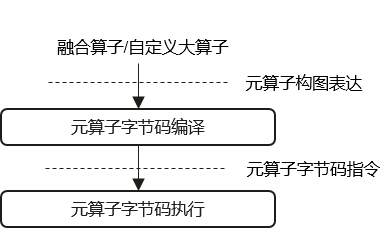
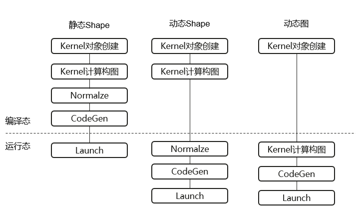
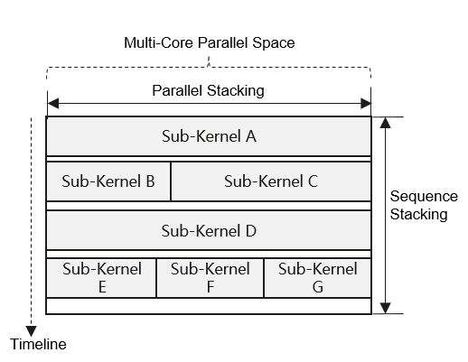

# DVM应用开发指南

本文介绍如何基于DVM完成不同类型算子的计算逻辑表达和执行。目标读者为基于DVM进行自定义算子或融合算子开发者。

## 1. 概述

在网络模型训练和推理中，为了高效利用算力，算子执行性能是至关重要的因素。为了提升算子执行性能，常用手段是将网络中的多个相邻算子融合为较大颗粒度的融合算子进行执行。这种算子融合所带来的好处是多方面的：一方面，由于融合降低执行算子总数，使得运行时开销大大降低；另一方面，由于融合可以提升算子计算局部性，进而减少访存带宽开销，使得算子整体性能也能获得极大提升。

为了实现算子的融合，当前业界一般采用两种方式：一、预先手写融合大算子； 二、在模型编译阶段根据图结构自动编译生成算子。这两种方式在动态Shape、动态图等动态算子执行场景都具有一定局限性：
+ 在动态Shape场景，具体算子Shape只有在运行阶段才能确定。由于无法在编译时刻预知具体Shape信息，这两种方式都只能以shape-general策略生成算子。使得它们在不同Shape泛化性、针对Shape特例优化方面存在不足；
+ 在融合能力方面，前者只能针对特定算子组合场景，网络覆盖范围有限。后者依赖静态构图，在动态图场景则无法使用。

对于如上问题，DVM的解决思路是：将算子生成过程从预先/编译态延后到执行态，从而能够基于运行态所确定的具体Shape进行算子生成。这个方式可以获得两方面好处：一方面不再面临shape-general生成难题；另一方面，也可以减少对编译构图的限制，比如符号Shape推导、裂图等问题。要想实现执行态算子生成，要解决的核心问题就是算子生成性能。因为传统算子编译耗时通常以秒为单位，而一般算子执行时间仅为十或百微秒级，相差万倍之遥。为了解决这个微秒级实时算子生成问题，DVM创新提出并使用了基于元算子虚拟机的算子编译和执行技术，其核心包括3层：
+ 用户基于元算子进行融合算子的计算逻辑构图表达；
+ DVM编译器（Host侧）基于用户的元算子计算构图，实时编译生成以Tile为粒度的元算子字节码虚拟指令；
+ DVM虚拟机（Device侧）解释执行DVM编译器生成的字节码虚拟指令，从而完成用户所定义的算子计算逻辑。




根据我们实测验证，由于Tile虚拟指令颗粒度大，且整个编译执行过程全部在内存中完成，使得大部分融合算子基本能在百微秒内完成算子编译生成过程。另外，由于Tile元算子指令能够与Ascend SIMD指令架构保持良好的对应性，且借助Ascend标量与矢量之间的Post-Execution机制以隐藏虚拟机解释执行开销，使得DVM在Ascend平台具有非常好的亲和性和执行性能。在很多场景下，性能甚至可以持平或超越对应手写算子。所以，在当前MindSpore等框架中，除了动态Shape算子之外，即使静态Shape融合也使用了DVM进行自动融合和生成。当然，在静态Shape场景，由于Shape不再改变，DVM已经无需每次重新实时做字节码指令CodeGen。

除了自动生成融合算子之外，DVM也可以用于自定义融合大算子、手写算子等其它一些传统算子使用场景，不再赘述。


## 2. 环境准备

### 2.1 环境要求

| 类别 | 要求 |
|------|------|
| 硬件 | Host - X86/aarch64等，Device - Ascend NPU |
| 操作系统 | Linux |
| 依赖软件 | CANN、GCC或Clang等 |

### 2.2 环境配置

```bash
# 初始化环境
# 默认路径，请根据实际安装位置修改
source /usr/local/Ascend/ascend-toolkit/set_env.sh
# 配置DVM环境
source env.sh
```

### 2.3 编译DVM静态库

```bash
make libdvm.a -j32
```

### 2.4 链接使用DVM静态库

将libdvm.a链接到您的代码工程中，并include包含dvm头文件(如dvm.h)进行使用。完整示例请参考 `examples/cc/muladd.cc`。


## 3. 开发入门

> **前置说明**：本文档所有C++代码示例基于以下假设编写：
> - **头文件**：`#include "dvm.h"`（DVM主头文件）
> - **变量来源**：`tensor_a/b/c`、`shape_a/b/c`等由用户自行准备；`ws_alloc`、`stream`由AI框架传入
> - **指针参数**：API中`IntArrayRef *`、`NDObject *`等指针参数，在示例中直接使用变量名（如`shape_a`）或取地址（如`&shape_a`）

从整体上，用户基于DVM进行算子定义表达和执行通常包括如下步骤：
1. Kernel对象创建：创建Kernel对象, 并根据所要融合的元算子计算选择对应的Kernel类型并Reset；
2. Kernel计算构图：基于DVM的元算子构图表达接口，完成该Kernel对应的计算逻辑表达；
3. Normalize: 调用Normalize接口，使其根据IntArrayRef参数所指向的最新Shape, 对计算操作进行Shape推导。 每次Shape发生变化都需要重新推导；
4. CodeGen: 调用CodeGen接口，使其进行Kernel编译并得到对应的字节码虚拟指令。动态shape每次Launch前都需要编译，静态Shape编译一次即可；
5. Launch: 调用Launch接口，使其根据该Kernel对应的字节码虚拟指令, 调用RTS Launch接口下发执行DVM虚拟机，并由其完成字节码虚拟指令的解释执行。

使用注意点：
+ 同一个Kernel对象，可以在更新输入输出地址（静态Shape）、重新编译（动态Shape）、重新构图和编译（动态图）等操作之后，被重新Launch执行；
+ 同一个Kernel对象，在以上不同操作之间不支持多线程竞争重入。但可以把这些不同步骤分配到不同线程依次顺序执行（如实现多线程流水下发等）；

对于静态图静态Shape、静态图动态Shape、动态图不同AI框架执行模式，如上步骤调用时机有所不同。如下图所示：




需要说明的是，DVM支持C++和Python两种接口。其中C++为基础接口。Python接口主要提供了对应C++接口的pybind封装，以确保不同下游的计算构图表达能够保持一致。本文主要以C++接口展开介绍。

### 2.1 静态图动态Shape融合

静态图动态Shape是指：在网络模型算子执行之前，能够确定融合子图。但融合子图的部分或全部输入Shape信息是未知的。对于这类场景，用户需要在执行之前，根据融合子图结构，提前完成计算构图表达。另外，由于Shape动态，所以需要在每次执行之前，重新进行Normalize和CodeGen操作。

对于动态Shape，AI框架主要适配点：
+ Kernel可以支持除kEager之外的所有其它Kernel类型。在Reset时，需要额外指定kDynamic flags以标识动态Shape；
+ 由于在构图阶段无法提供load/store对应的tensor内存地址，需要在CodeGen时通过RelocEntry重定位表进行重定位修改。

以如下动态Shape融合子图为例:
```
graph(tensor_a: float32) -> tensor {
  tensor_b: float32 = add(tensor_a, 0.5)
  tensor_c: float32 = mul(tensor_b, tensor_a)
  return tensor_c
}
```

代码示例如下：
```c++
/*****  编译阶段 *****/
// 1.  创建DVM Kernel对象
dvm::Kernel k;
k.Reset(dvm::kVector, dvm::kDynamic);
// 2. 计算构图
IntArrayRef shape_ref;
auto a = k.Load(nullptr, &shape_ref, dvm::kFloat32);
auto b = k.Binary<dvm::kAdd>(a, 0.5);
auto c = k.Binary<dvm::kMul>(b, a);
auto out = k.Store(nullptr, c);

/*****  执行阶段: 1 *****/
// 3. 更新输入Shape
std::vector<int64_t> shape = {32, 1024};
shape_ref = shape; // 更新输入shape
// 4. Normalize
k.Normalize();
// 5. 根据输入输出Tensor地址配置重定位表，并CodeGen
std::vector<RelocEntry> relocs;
relocs.emplace_back(a, tensor_a.addr());
relocs.emplace_back(out, tensor_c.addr());
k.CodeGen(relocs.data(), relocs.size(), ws_alloc);
// 6. 进行kernel launch执行
k.Launch(stream);

/*****  执行阶段: 2 *****/
std::vector<int64_t> shape = {10, 512};
shape_ref = shape; // 更新输入shape
...  // Normalize, CodeGen, Launch ...
```

### 2.2 静态图静态Shape融合

静态图静态Shape是指：在网络模型算子执行之前，能够确定融合子图。且融合子图的全部输入Shape信息都可确定。对于这类场景，由于shape不再变化，Normalize只需要执行一次。在DVM内部，为了避免重复编译增大host开销，会在首次Normalize时提前完成编译过程。之后的CodeGen过程主要完成地址重定位。对应字节码虚拟指令会每次重用。其它使用方式与动态Shape一致，不再赘述。

### 2.3 动态图实时融合

动态图(Eager)模式是指：AI框架在下发执行网络中的算子之前, 没有单独的计算图构图和图优化过程。对于这种执行模式，业界主要以预置手写融合算子为主。但对于DVM来说，除了手写算子之外，也可以在动态图算子下发过程中进行自动实时融合。本小节主要介绍实时融合使用方法。

对于AI框架，如果需要使用实时融合，需要进行如下适配：
+ 根据动态图所要下发执行的算子，创建DVM Kernel(类型为kEager)并构建对应计算表达。对应相邻的多个下发算子，建议尽量使用同一个DVM Kernel对象(DVM内部会自动对元算子表达进行融合切图），以实现算子融合效果；
+ 如果Kernel计算表达已经确定(如遇到不可融合的后继算子、Host需要获取输出结果等），进行Kernel的CodeGen和Launch。

代码示例如下：
```c++
dvm::Kernel k;
k.Reset(dvm::kEager, 0);

// meet: tensor_c = add(tensor_a, tensor_b)
auto a = k.Load(tensor_a.addr(), shape_a, dvm::kFloat32);
auto b = k.Load(tensor_b.addr(), shape_a, dvm::kFloat32);
auto c = k.Binary<dvm::kAdd>(a, b);

// meet: tensor_d = sqrt(tensor_c)
auto d = k.Unary<dvm::kSqrt>(c);

// meet: print(tensor_d). should submit to execute 
k.Store(tensor_d.addr(), d);
k.CodeGen(nullptr, 0, ws_alloc);
k.Launch(stream);
```

注意事项：
+ 为了减少反复对象创建申请开销，DVM支持同一个Eager Kernel对象被重新用于新的融合构图和执行。但需要在上次Launch之后，调用Clear接口进行状态清理；
+ Eager Kernel支持DVM内部自动切图。图层无需额外考虑融合pattern；
+ Eager模式没有单独的Normalize调用。


## 4. Kernel模型

根据不同元算子融合场景，DVM定义了不同类型的KernelType。这些Kernel可以分为两类：
+ 元Kernel: 包括kVector、 kCube、 kMix三种类型。 作为最基础的Kernel执行单位。其包含的元算子组合受限于融合Pattern；
+ 堆叠Kernel：包括kParallel、kSequence、kSplit、kEager。将多个元算子Kernel堆叠在一起进行整体执行。前两者实现手工堆叠，后两者分别对应图模式和Eager模式的自动堆叠。

通过将不同类型元算子进行堆叠执行，既充分利用和发挥了DVM字节码编译的灵活性，又能显著降低运行时开销和提升硬件资源利用率。堆叠执行图示如下：



DVM当前支持的Kernel类型整体对比如下表：

| Kernel名 | Kernel类型 | 功能描述 | 适用场景 |
| -------- | ---------- | -------- | -------- |
| kVector | 元Kernel | 实现Vector计算融合。受限融合pattern | 提高局部性，降低访存开销 |
| kCube | 元Kernel | 实现Cube计算(MatMul，GMM)。不支持融合 | 作为堆叠基础 |
| kMix | 元Kernel | 实现Cube计算后融Vector计算。受限融合Pattern | 提高Cache局部性，提高多核算力利用率 |
| kParallel | 并行堆叠 | 实现多个元Kernel并行堆叠，并由不同core并行执行 | 提高多核并行度和算力利用率 |
| kSequence | 顺序堆叠 | 实现多个不同元Kernel或kParallel顺序堆叠, 并顺序执行 | 降低运行时开销 |
| kSplit | 自动堆叠 | 将融合算子根据融合Pattern自动split为多个并行/顺序堆叠的元Kernel | 图模式复杂融合 |
| kEager | 自动堆叠 | Eager模式自动堆叠 | Eager复杂融合 |


### 4.1 Vector元Kernel

主要支持多个Vector计算之间的融合。这些被融合的Vector计算使用AIV核的Unified Buffer(UB)局部内存进行计算和数据交换，从而大大减少对全局GM内存的访存开销。所包含的元算子计算需要满足如下条件：
+ Shape计算空间可仿射合并；
+ 如果存在多个Reduce计算，其reduce输出shape需要一致；
+ 如果Reduce计算向后融合了其它Vector元算子，不能保证总能融合为单一执行Kernel；

构图表达代码示例：
```c++
dvm::Kernel k;
k.Reset(dvm::kVector, 0);

auto a = k.Load(tensor_a.addr(), shape_a, dvm::kFloat16);
auto b = k.Load(tensor_b.addr(), shape_a, dvm::kFloat16);
auto c = k.Binary<dvm::kAdd>(a, b);
auto d = k.Binary<dvm::kSqrt>(c);
auto e = k.Reduce<dvm::kSum>(d, &dims, true);
auto out = k.Store(nullptr, e);
```

### 4.2 Cube元Kernel

这种Kernel类型只支持MatMul或GroupedMatMul计算。这两类计算都会提交到AIC核进行计算。主要功能规格：
+ 数据类型只支持Float16或BFloat16；
+ 支持bias输入；
+ 支持对左或右输入矩阵做transpose；
+ 支持最大2个batch维度，且支持batch维度广播。

构图表达代码示例：
```c++
dvm::Kernel k;
k.Reset(dvm::kCube, 0);

auto a = k.Load(tensor_a.addr(), shape_a, dvm::kFloat16);
auto b = k.Load(tensor_b.addr(), shape_a, dvm::kFloat16);
auto c = k.MatMul(a, b, false, false, nullptr);
auto out = k.Store(nullptr, c);
```

### 4.3 Mix元Kernel

Mix主要支持Cube计算后融若干Vector计算。 在Kernel执行时，Cube计算使用AIC核，而Vector计算使用AIV核。通过Mix融合，可以使得Cube计算和Vector计算能够在Cube Tile粒度互相Overlap，并提高数据Cache命中率。

Cube计算规格与3.2小节描述一致，所后续融合的Vector计算只支持elemwise类计算。构图代码示例：
```c++
dvm::Kernel k;
k.Reset(dvm::kMix, 0);

// Cube计算
auto a = k.Load(tensor_a.addr(), shape_a, dvm::kFloat16);
auto b = k.Load(tensor_b.addr(), shape_a, dvm::kFloat16);
auto c = k.MatMul(a, b, false, false, nullptr);

// Vector计算
auto d = k.Cast(c, dvm::kFloat32);
auto e = k.Load(tensor_p.addr(), shape_p, dvm::kFloat32);
auto f = k.Add(d, e);
auto out = k.Store(nullptr, f);
```

### 4.4 Parallel堆叠

Parallel堆叠可以实现将多个相互之间无依赖的元Kernel分配到不同的AIC/AIV核并行计算执行，从而提升多核并行度和整体算力利用率。

主要功能规格：
+ 支持多个Vector、Cube、Mix的同类型或不同类型元Kernel做并行堆叠；
+ 在使用ParallelAdd时，可以对部分或全部子Kernel指定其最大可用核数上限。所有核数上限之和不能超过物理可用核数。

以实现Vector、Cube两个不同类型kernel并行为例，对应构图代码示例如下：
```c++
dvm::Kernel k;
k.Reset(dvm::kParallel, 0);

// Kernel 1 
k.ParallelAdd(dvm::kVector);
auto a1 = k.Load(tensor_a.addr(), shape_a, dvm::kFloat32);
auto a2 = k.Add(a1, 1.0);
auto a3 = k.Reduce<dvm::kSum>(a2, &dims, false);
auto out_a = k.Store(nullptr, a3);

// Kernel 2
k.ParallelAdd(dvm::kCube);
auto b1 = k.Load(tensor_b.addr(), shape_b, dvm::kFloat16);
auto b2 = k.Load(tensor_c.addr(), shape_c, dvm::kFloat16);
auto b3 = k.MatMul(b1, b2, false, false, nullptr);
auto out_b = k.Store(nullptr, b3);
```

### 4.5 Sequence堆叠

Sequence堆叠可以实现将多个元Kernel、Parallel Kernel顺序堆叠执行。主要用于降低运行时调度开销。这些顺序堆叠的Kernel之间可以存在依赖关系。

主要功能规格：
+ 对于不同Kernel之间的数据传递，Sequence会自动插入Load/Store；
+ 不同子Kernel之间需要通过SequenceAdd显式区分。

构图代码示例：
```c++
dvm::Kernel k;
k.Reset(dvm::kSequence, 0);

// Kernel 1 
k.SequenceAdd(dvm::kVector, 0);
auto a1 = k.Load(tensor_a.addr(), shape_a, dvm::kFloat32);
auto a2 = k.Add(a1, 1.0);
auto a3 = k.Cast(a2, dvm::kFloat16);

// Kernel 2
k.SequenceAdd(dvm::kMix, 0);
auto b1 = k.Load(tensor_b.addr(), shape_b, dvm::kFloat16);
auto b2 = k.MatMul(a3, b1, false, true, nullptr); // 直接使用a3
auto b3 = k.Binary<dvm::kMul>(b2, 0.5);
auto out_b = k.Store(nullptr, b3);
```

### 4.6 Split堆叠

Split堆叠功能类似Sequence堆叠。不同点是，Split会自动将整体计算表达拆分为多个子Kernel，无需用户显式调用SequenceAdd进行区分。构图代码示例：
```c++
dvm::Kernel k;
k.Reset(dvm::kSplit, 0);

auto a1 = k.Load(tensor_a.addr(), shape_a, dvm::kFloat32);
auto a2 = k.Add(a1, 1.0);
auto a3 = k.Cast(a2, dvm::kFloat16);
auto b1 = k.Load(tensor_b.addr(), shape_b, dvm::kFloat16);
auto b2 = k.MatMul(a3, b1, false, true, nullptr); // 直接使用a3
auto b3 = k.Binary<dvm::kMul>(b2, 0.5);
auto out_b = k.Store(nullptr, b3);
```

对于如上构图，Split会自动拆分为两个子Kernel顺序调用执行。

### 4.7 Eager堆叠

Eager堆叠类似Split堆叠。不同点是，Split用于图模式，会缓存构图信息以多次使用。Eager用于动态图模式，会默认每次重新构图。具体使用可参考2.3章节。

## 5. Python接口使用

除了C++接口外，DVM也支持基于Python接口进行构图表达。Python接口主要用于自定义融合算子等场景。Python接口借助装饰器等Python语法机制，屏蔽了C++接口对应的Normalize/CodeGen/Launch等调用，所以使用上会更加简单。

对于每个融合算子，用户需要实现一个对应的Python函数用于进行构图表达，并且这个函数需要使用```dvm.kernel```装饰器进行装饰。这个Python构图函数的首个参数为装饰器自动插入的Kernel对象，其它参数为kernel调用所对应的placeholder参数。完成构图之后，可以真实Tensor为输入（依赖下游AI框架），调用这个python构图函数即可完成Kernel的编译执行。代码示例：

```python
import dvm

# 构图
@dvm.kernel
def my_add(k, x, y):
    a = k.load(x, dvm.float32)
    b = k.load(y, dvm.float32)
    c = k.add(a, b)
    d = k.store(c)
    return d

# 调用
z = my_add(x, y)
```

## 6. Debug调测

DVM支持多种调测方式，用于定位解决融合算子开发使用过程中遇到的各类问题。

### 5.1 Dump元算子构图

可以使用Kernel.Dump接口进行该Kernel对应的元算子表达构图。比如：
```c++
dvm::Kernel k;
k.Reset(...);

// 元算子构图
...

// 打印元算子子图
std::cout << k.Dump() << std::endl; 
```

### 5.2 Dump字节码汇编

可以使用Kernel.Das接口获取该Kernel在CodeGen所得到的虚拟指令反编译。比如：
```c++
dvm::Kernel k;
k.Reset(...);

// 元算子构图
...

k.Normalize();
k.CodeGen(...);

// 打印反汇编
std::cout << k.Das() << std::endl; 
```

### 5.3 使用debug版本

DVM内部对于各类错误使用场景会有不同ASSERT断言处理。但为了实时CodeGen性能，这些断言在Release版本中不会编译使能。所以，如果算子执行异常，一种可能方式是替换DVM的Debug版本。

如果需要使用DVM Debug版本, 请在DVM编译make命令中增加```dbg=1```选项。比如：```make dbg=1 -j8```

 
## 7. API列表

DVM C++ API大部分都以Kernel类成员函数进行实现。以下API接口如无特别说明，默认都是Kernel类成员函数。

### 7.1 Kernel初始化

| API | 说明 |
| --- | --- |
| `void Reset(KernelType type, uint32_t flags)` | 重置初始化，需要完成构图才能使用 |
| `void Clone(const Kernel &base, CloneHelper &helper)` | 从已经完成构图的Kernel克隆初始化，无需重复构图 |
| `void SetNameHint(const char *name, const char *fullname)` | 设置Kernel名字信息 |

### 7.2 构图表达

#### 7.2.1 全局访存

| API | 说明 |
| --- | --- |
| `NDObject *Load(void *addr, IntArrayRef *shape, DataType type)` | 连续Load |
| `NDObject *Load(void *addr, IntArrayRef *shape, IntArrayRef *stride, DataType type)` | 非连续Load |
| `NDObject *Store(void *addr, NDObject *input)` | Store |

#### 7.2.2 Vector计算

| API | 说明 |
| --- | --- |
| `NDObject *Unary<kSqrt>(NDObject *input)` | 开平方 |
| `NDObject *Unary<kAbs>(NDObject *input)` | 绝对值 |
| `NDObject *Unary<kLog>(NDObject *input)` | 对数 |
| `NDObject *Unary<kExp>(NDObject *input)` | 自然指数 |
| `NDObject *Unary<kReciprocal>(NDObject *input)` | 倒数 |
| `NDObject *Unary<kIsFinite>(NDObject *input)` | 有限数值判断 |
| `NDObject *Unary<kLogicalNot>(NDObject *input)` | 逻辑反 |
| `NDObject *Unary<kRound>(NDObject *input)` | 四舍五入取整 |
| `NDObject *Unary<kFloor>(NDObject *input)` | 向下取整 |
| `NDObject *Unary<kCeil>(NDObject *input)` | 向上取整 |
| `NDObject *Unary<kTrunc>(NDObject *input)` | 数值截断 |
| `NDObject *Binary<kAdd>([NDObject *\|Scalar] lhs,  [NDObject *\|Scalar] rhs)` | 加法 |
| `NDObject *Binary<kSub>([NDObject *\|Scalar] lhs,  [NDObject *\|Scalar] rhs)` | 减法 |
| `NDObject *Binary<kMul>([NDObject *\|Scalar] lhs,  [NDObject *\|Scalar] rhs)` | 乘法 |
| `NDObject *Binary<kDiv>([NDObject *\|Scalar] lhs,  [NDObject *\|Scalar] rhs)` | 除法 |
| `NDObject *Binary<kPow>([NDObject *\|Scalar] lhs,  [NDObject *\|Scalar] rhs)` | 指数幂 |
| `NDObject *Binary<kMaximum>([NDObject *\|Scalar] lhs,  [NDObject *\|Scalar] rhs)` | 提取最大值 |
| `NDObject *Binary<kMinimum>([NDObject *\|Scalar] lhs,  [NDObject *\|Scalar] rhs)` | 提取最小值 |
| `NDObject *Binary<kEqual>([NDObject *\|Scalar] lhs,  [NDObject *\|Scalar] rhs)` | 相等 |
| `NDObject *Binary<kNotEqual>([NDObject *\|Scalar] lhs,  [NDObject *\|Scalar] rhs)` | 不等于 |
| `NDObject *Binary<kGreater>([NDObject *\|Scalar] lhs,  [NDObject *\|Scalar] rhs)` | 大于 |
| `NDObject *Binary<kGreaterEqual>([NDObject *\|Scalar] lhs,  [NDObject *\|Scalar] rhs)` | 大于等于 |
| `NDObject *Binary<kLess>([NDObject *\|Scalar] lhs,  [NDObject *\|Scalar] rhs)` | 小于 |
| `NDObject *Binary<kLessEqual>([NDObject *\|Scalar] lhs,  [NDObject *\|Scalar] rhs)` | 小于等于 |
| `NDObject *Binary<kLogicalAnd>([NDObject *\|Scalar] lhs,  [NDObject *\|Scalar] rhs)` | 逻辑与 |
| `NDObject *Binary<kLogicalOr>([NDObject *\|Scalar] lhs,  [NDObject *\|Scalar] rhs)` | 逻辑或 |
| `NDObject *Reduce<kSum>(NDObject *input, IntArrayRef *dims, bool keepdims)` | 规约求和 |
| `NDObject *Reduce<kMax>(NDObject *input, IntArrayRef *dims, bool keepdims)` | 规约求最大值 |
| `NDObject *Reduce<kMin>(NDObject *input, IntArrayRef *dims, bool keepdims)` | 规约求最小值 |
| `NDObject *Select(NDObject *cond, NDObject *lhs, NDObject *rhs)` | 数值选择 |
| `NDObject *Cast(NDObject *input, DataType type)` | 类型转换 |
| `NDObject *Broadcast(NDObject *input, IntArrayRef *shape)` | 张量广播 |
| `NDObject *Broadcast([Scalar] val, IntArrayRef *shape, DataType type)` | 标量广播 |
| `NDObject *Reshape(NDObject *input, IntArrayRef *shape)` | Reshape |
| `NDObject *Copy(NDObject *input)` | 张量拷贝 |

#### 7.2.3 Cube计算

| API | 说明 |
| --- | --- |
| `NDObject *MatMul(NDObject *lhs, NDObject *rhs, bool trans_a, bool trans_b, NDObject *bias)` | 矩阵乘法 |
| `NDObject *GroupedMatMul(NDObject *lhs, NDObject *rhs, bool trans_a, bool trans_b, NDObject *bias, ...)` | 分组矩阵乘法 |

#### 7.2.4 内存语义通信

| API | 说明 |
| --- | --- |
| `NDObject *AllReduce(NDObject *input, const Comm *comm)` | AllReduce |
| `NDObject *AllGather(NDObject *input, const Comm *comm)` | AllGather |
| `NDObject *AllGatherV2(NDObject *input, const Comm *comm)` | AllGatherV2 |
| `NDObject *ReduceScatter(NDObject *input, const Comm *comm)` | ReduceScatter |

#### 7.2.5 构图控制

| API | 说明 |
| --- | --- |
| `void SetStoreInplace(NDObject *store)` | 标记原地Store |
| `void SpecNext()` | 切换下一个投机分段 |
| `void ParallelAdd(KernelType type, uint32_t flags, size_t thread_limit = 0)` | 添加并行堆叠子Kernel |
| `void SequenceAdd(KernelType type, uint32_t flags)` | 添加顺序堆叠子Kernel |

### 7.3 编译执行

| API | 说明 |
| --- | --- |
| `void Normalize()` | Shape推导和正则化 |
| `void CodeGen(const RelocEntry *relocs, size_t reloc_size, WsAllocator *ws_alloc)` | 编译生成字节码 |
| `int Launch(void *stream)` | 下发执行 |
| `size_t PreCodeGen()` | 预编译 |
| `int Launch(const RelocEntry *relocs, size_t reloc_size, void *workspace, void *stream)` | 预编译下发执行 |
| `void Clear()` | 清理执行上下文(Eager) |

### 7.4 杂项

| API | 说明 |
| --- | --- |
| `IntArrayRef *GetShape(NDObject *op)` | 获取OP Shape |
| `DataType GetDType(NDObject *op)` | 获取Op 数据类型 |
| `const char *Dump() const` | Dump元算子构图 |
| `const char *Das() const` | Dump字节码反汇编 |

### 7.5 全局配置

全局配置接口通过Config单例进行提供。

| API/类型 | 说明 |
| --- | --- |
| `Config &SetDeterm()` | 开启确定性计算 |
| `Config &UnsetDeterm()` | 关闭确定性计算 |
| `Config &SetOnlineTuner()` | 开启在线Tuning |
| `Config &UnsetOnlineTuner()` | 关闭在线Tuning |
| `Config &SetLazyTuner()` | 开启Lazy Tuning |
| `Config &UnsetLazyTuner()` | 关闭Lazy Tuning |